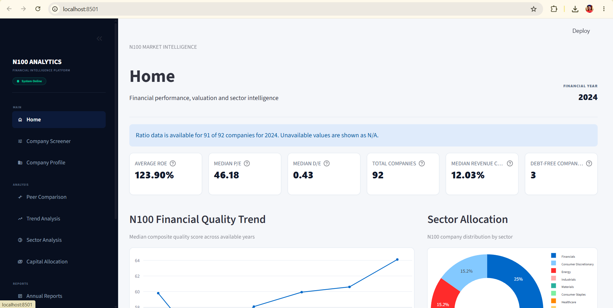
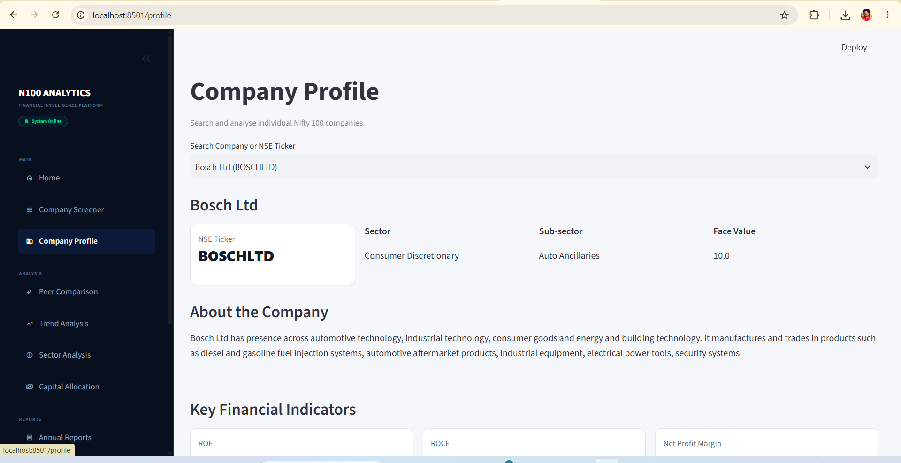
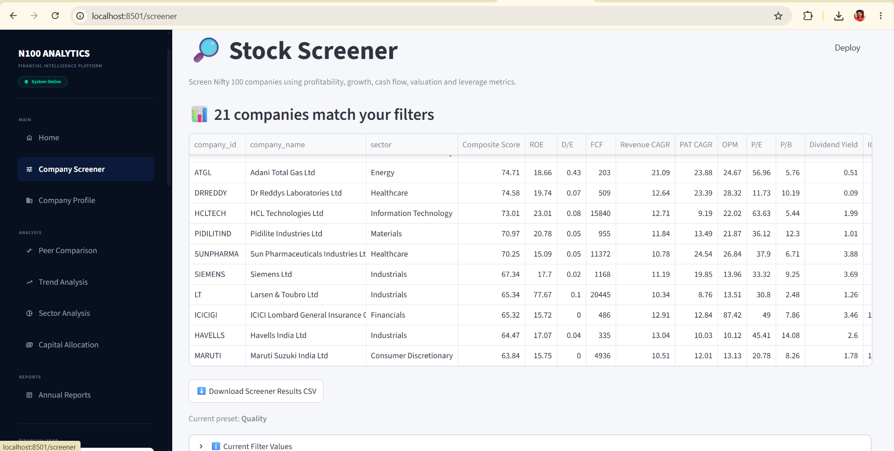
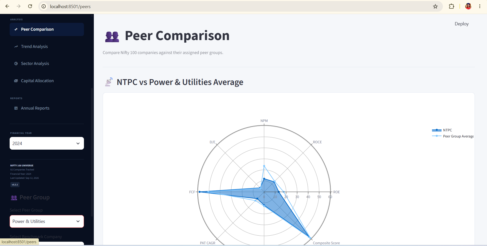
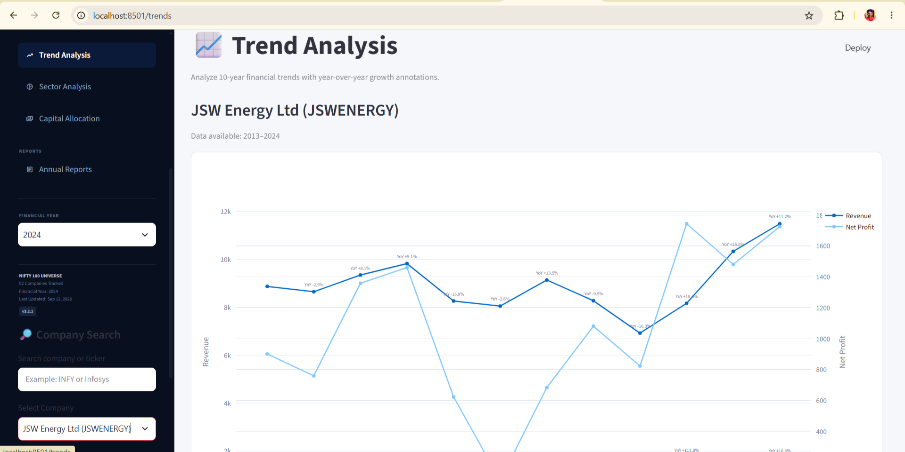
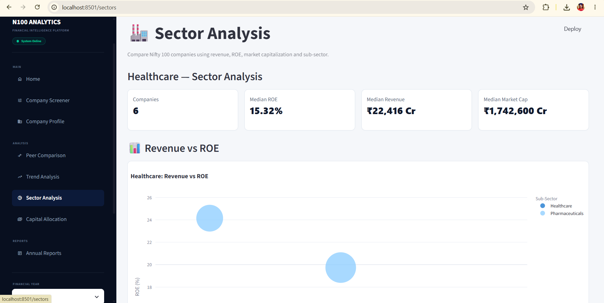
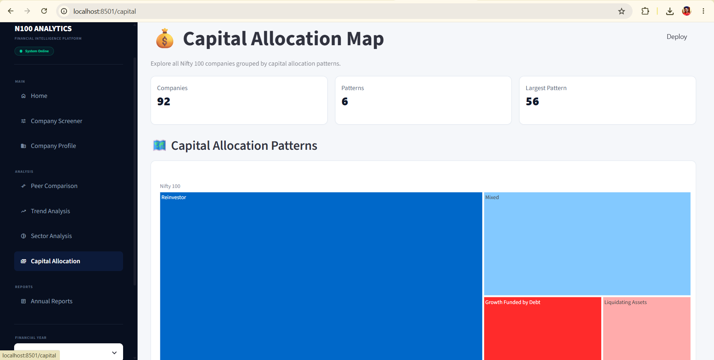
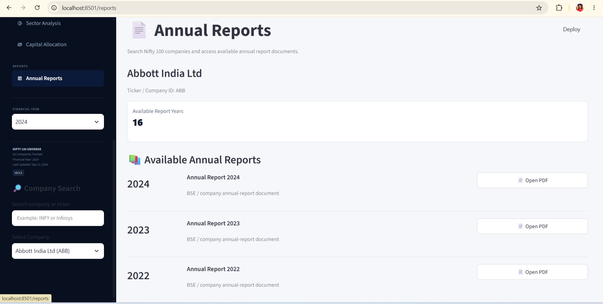

# N100 Financial Intelligence Platform

A financial intelligence and analytics platform for analyzing financial and qualitative information from **92 Nifty 100 companies**: ETL, ratio engine, screener, peer comparison, valuation, NLP, PDF reports, clustering, an 8-screen Streamlit dashboard and a 16-endpoint FastAPI server.

---

## Table of Contents

1. [Project Overview](#project-overview)
2. [Master Sprint Checklist](#master-sprint-checklist)
3. [Technology Stack](#technology-stack)
4. [Project Structure](#project-structure)
5. [Setup and Running the Project](#setup-and-running-the-project)
6. [Important Rules](#important-rules)
7. [Database](#database)
8. [Sprint 1: Data Foundation](#sprint-1--data-foundation)
9. [Sprint 2: Financial Ratio Engine](#sprint-2--financial-ratio-engine)
10. [Sprint 3: Screener & Peer Comparison Engine](#sprint-3--screener--peer-comparison-engine)
11. [Sprint 4: Dashboard & Valuation Module](#sprint-4--dashboard--valuation-module)
12. [Sprint 5: Intelligence, NLP & PDF Reports](#sprint-5--intelligence-nlp--pdf-reports)
13. [Sprint 6: API Server, Clustering & Final QA](#sprint-6--api-server-clustering--final-qa)
14. [Deliverables Tracker (All 23 Outputs)](#deliverables-tracker-all-23-outputs)
15. [Final Project Status](#final-project-status)
16. [Data Disclaimer](#data-disclaimer)
17. [Author](#author)

---

## Project Overview

| Item | Detail |
|---|---|
| Companies | 92 (Nifty 100 dataset) |
| Database | SQLite (`nifty100.db`) |
| Project start date | 05 Jul 2026 |
| Sprints | 6 (Days 01–45) |
| Dashboard | 8-screen Streamlit app (port 8501) |
| API | FastAPI, 16 endpoints under `/api/v1` (port 8000) |
| Currency | All monetary values in INR Crore |

**Capabilities:** data ingestion and ETL, normalization and validation, SQLite management, financial ratio analytics, company screening, peer comparison, trend and sector analysis, capital allocation analysis, valuation analytics, NLP and qualitative intelligence, PDF reports, KMeans clustering, REST API, automated testing and QA.

---

## Master Sprint Checklist

| # | Sprint | Days | Story Points | Tasks | Deliverables | Status |
|---|---|---|---:|---|---|---|
| 1 | Data Foundation | 01–07 | 34 | ✅ 7 / 7 | ✅ D-01 to D-04 | ✅ COMPLETE |
| 2 | Financial Ratio Engine | 08–14 | 42 | ✅ 7 / 7 | ✅ D-05, D-06 | ✅ COMPLETE |
| 3 | Screener & Peer Comparison Engine | 15–21 | 49 | ✅ 7 / 7 | ✅ D-07 to D-10 | ✅ COMPLETE |
| 4 | Dashboard & Valuation Module | 22–28 | n/a | ✅ 7 / 7 | ✅ D-11, D-12 | ✅ COMPLETE |
| 5 | Intelligence, NLP & PDF Reports | 29–35 | 70 | ✅ 7 / 7 | ✅ D-13 to D-18 | ✅ COMPLETE |
| 6 | API Server, Clustering & Final QA | 36–45 | 89 | ✅ 10 / 10 | ✅ D-19 to D-23 | ✅ COMPLETE |

**Overall: 6 / 6 sprints complete · 23 / 23 deliverables complete · 20 / 20 acceptance gates passed**

---

## Technology Stack

| Category | Technologies |
|---|---|
| Programming | Python |
| Data Processing | Pandas, NumPy |
| Excel Processing | OpenPyXL |
| Database | SQLite |
| Analytics / ML | SciPy, Scikit-learn (KMeans, StandardScaler) |
| Visualization | Plotly, Matplotlib, Seaborn |
| Dashboard | Streamlit |
| API | FastAPI, Uvicorn |
| Reports | ReportLab |
| Testing | Pytest, pytest-html |
| Code Quality | Black, Ruff |
| Development | Git, VS Code, Python virtual environment |

---

## Project Structure

```text
N100-Financial-Intelligence-Platform/
│
├── config/
│   └── screener_config.yaml          # Analyst-editable screener thresholds
│
├── data/
│   ├── raw/                          # Source Excel files
│   └── supporting/                   # Supplementary datasets
│
├── db/
│   └── schema.sql                    # SQLite schema
│
├── docs/
│   ├── analyst_guide.pdf             # 10+ page user guide
│   ├── acceptance_checklist.pdf      # Signed acceptance checklist
│   └── openapi.json                  # OpenAPI 3.0 specification
│
├── src/
│   ├── etl/
│   │   ├── loader.py
│   │   ├── normaliser.py
│   │   ├── validator.py
│   │   └── db_loader.py
│   │
│   ├── analytics/
│   │   ├── ratios.py
│   │   ├── cagr.py
│   │   ├── cashflow_kpis.py
│   │   ├── peer.py
│   │   ├── valuation.py
│   │   └── clustering.py
│   │
│   ├── screener/
│   │   └── engine.py
│   │
│   ├── nlp/
│   │   ├── parser.py
│   │   └── pros_cons_generator.py
│   │
│   ├── dashboard/
│   │   ├── app.py
│   │   ├── sidebar.py
│   │   ├── pages/
│   │   │   ├── 01_home.py
│   │   │   ├── 02_profile.py
│   │   │   ├── 03_screener.py
│   │   │   ├── 04_peers.py
│   │   │   ├── 05_trends.py
│   │   │   ├── 06_sectors.py
│   │   │   ├── 07_capital.py
│   │   │   └── 08_reports.py
│   │   └── utils/
│   │       ├── db.py
│   │       └── api_client.py
│   │
│   ├── api/
│   │   ├── main.py
│   │   └── routers/
│   │       ├── companies.py
│   │       ├── screener.py
│   │       ├── sectors.py
│   │       ├── peers.py
│   │       ├── valuation.py
│   │       ├── portfolio.py
│   │       ├── documents.py
│   │       └── health.py
│   │
│   └── reports/
│       ├── tearsheet.py
│       └── sector_report.py
│
├── tests/
│   ├── api/
│   ├── dq/
│   ├── etl/
│   ├── integration/
│   ├── kpi/
│   └── screener/
│
├── notebooks/
│   └── exploratory_queries.sql
│
├── output/                           # CSV / XLSX outputs and logs
│   └── final_deliverables/           # Archive of all 23 deliverables
│
├── reports/
│   ├── tearsheets/                   # 92 company PDFs
│   ├── sector/                       # 11 sector PDFs
│   ├── portfolio/                    # Portfolio summary PDF
│   ├── radar_charts/                 # Radar chart PNGs
│   ├── elbow_plot.png
│   ├── correlation_heatmap.png
│   └── pytest_report.html
│
├── screenshots/                      # Dashboard screenshots
├── scripts/
├── nifty100.db
├── requirements.txt
├── pyproject.toml
├── Makefile
├── .env
└── README.md
```

---

## Setup and Running the Project

### 1. Prerequisites

- Python 3.10 or later
- Git
- Windows PowerShell (commands below use PowerShell)

### 2. Clone and install

```powershell
git clone https://github.com/Ravikumar07-Byte/N100-Financial-Intelligence-Platform.git
cd N100-Financial-Intelligence-Platform

python -m venv .venv
.venv\Scripts\Activate.ps1

pip install -r requirements.txt
```

Create a `.env` file in the project root only if your configuration needs one (it is not committed).

### 3. Database and ETL

The SQLite database `nifty100.db` is included in the repository, so you can run the dashboard and API straight after installing. Rebuild it only if you want to reload the source data.

**Rebuild from source files (optional)**

Place the 12 source files (7 core Excel + 5 supplementary) under `data/raw/` and `data/supporting/`, then run:

```powershell
python -m src.etl.db_loader
python populate_financial_ratios.py
python generate_capital_allocation.py
```

The loader writes the audit outputs (`output/load_audit.csv`, `output/validation_failures.csv`). Core Excel files are read with `pd.read_excel(path, header=1)`.

**Verify the database**

```powershell
python -c "import sqlite3; c=sqlite3.connect('nifty100.db'); print('companies:', c.execute('SELECT COUNT(*) FROM companies').fetchone()[0]); print('FK violations:', len(c.execute('PRAGMA foreign_key_check').fetchall()))"
```

Expected: `companies: 92` and `FK violations: 0`.

### 4. Run the dashboard

```powershell
streamlit run src/dashboard/app.py --server.port 8501
```

Open `http://localhost:8501`.

### 5. Run the API

```powershell
uvicorn src.api.main:app --host 127.0.0.1 --port 8000
```

- Interactive docs: `http://127.0.0.1:8000/docs`
- Health check: `curl "http://127.0.0.1:8000/api/v1/health"`
- Screener example: `curl "http://127.0.0.1:8000/api/v1/screener?min_roe=15"`

Run the dashboard and API in two separate terminals. Ports 8501 and 8000 do not conflict.

### 6. Generate analytics outputs and reports

```powershell
python src/analytics/valuation.py        # valuation_summary.xlsx, valuation_flags.csv
python src/reports/batch_reports.py      # company tearsheets and sector reports
python src/reports/portfolio_summary.py  # portfolio summary PDF
```

Reports are written under `reports/`.

### 7. Run the test suite

```powershell
python -m pytest tests -v
```

| Scope | Command |
|---|---|
| Full suite with HTML report | `python -m pytest tests --html=reports/pytest_report.html` |
| ETL tests | `python -m pytest tests/etl -v` |
| KPI tests | `python -m pytest tests/kpi -v` |
| DQ rule tests | `python -m pytest tests/dq -v` |
| API tests | `python -m pytest tests/api -v` |
| Performance tests | `python -m pytest tests/performance -v -s` |

### 8. Code quality and maintenance

```powershell
python -m compileall -q src   # compile check
black src/ tests/             # format
ruff check src/ tests/        # lint
```

If port 8501 or 8000 is busy, see the troubleshooting section of `docs/analyst_guide.pdf`.

---

## Important Rules

- Use `pd.read_excel(path, header=1)` for all core Excel files.
- Always normalize `company_id` (trim spaces, convert to uppercase) before joins.
- All monetary values are stored in **INR Crore**.
- Skip the **Financials** sector when applying the D/E screener filter.
- If CAGR has a negative base year, return `TURNAROUND` instead of calculating CAGR.
- If Interest Expense = 0, display `Debt Free` instead of dividing by zero.
- Clearly label simulated datasets (`stock_prices`, `market_cap`) as **SIMULATED** in dashboards and reports.
- Run `make test` before every Git commit. Zero test failures are mandatory.

---

## Database

The primary database is **`nifty100.db`** (SQLite).

**Tables:** `companies`, `profitandloss`, `balancesheet`, `cashflow`, `analysis`, `documents`, `prosandcons`, `sectors`, `stock_prices`, `financial_ratios`, `peer_groups`, plus `peer_percentiles` (added in Sprint 3).

```text
Companies:               92
Unique Company IDs:      92
Missing Company IDs:     0
Missing Company Names:   0
Foreign-Key Violations:  0
Duplicate Business Keys: 0
Stock price records:     5,520
```

### Companies table columns

```text
id, company_logo, company_name, chart_link, about_company, website,
nse_profile, bse_profile, face_value, book_value,
roce_percentage, roe_percentage
```

> The `companies` table uses **`id`** as the company identifier (not `company_id`). Verify with `PRAGMA table_info(companies);`.

---

## Sprint 1 — Data Foundation

**Days:** 01–07 · **Story Points:** 34 · **Epic 01:** Data Ingestion & ETL
**Status:** ✅ COMPLETE

### Sprint Goal

By the end of Sprint 1, the team must have a fully loaded and validated SQLite database (`nifty100.db`) containing all tables from the 12 source files. All 16 data quality rules must have been run and any CRITICAL failures resolved. The foundation for all subsequent modules must be in place.

### Sprint 1 Checklist

- [x] **Day 01: Environment Setup.** Create directories, venv, install 20 libraries, `.env`, Makefile targets
- [x] **Day 02: Excel Loader & Normaliser.** `loader.py`, `normalize_year()`, `normalize_ticker()`, 35+ unit tests
- [x] **Day 03: Schema Validator (16 DQ Rules).** DQ-01 to DQ-16; CRITICAL PK/FK checks; WARNING OPM, balance, sales checks; `validation_failures.csv`
- [x] **Day 04: SQLite Database Schema.** `schema.sql`, PK/FK constraints, `PRAGMA foreign_keys = ON`
- [x] **Day 05: Full Data Load, All 12 Files.** 7 core + 5 supplementary files, load order, `load_audit.csv`, FK check
- [x] **Day 06: Data Quality Manual Review.** 5 random companies, year coverage, companies with fewer than 5 years, fix loader bugs, re-run
- [x] **Day 07: Sprint Wrap-Up & Review.** `exploratory_queries.sql`, unit tests with 0 failures, demo `nifty100.db`, retrospective, update board

### ETL Pipeline

```text
Source Excel Files
        │
        ▼
Data Loading            (loader.py)
        │
        ▼
Normalization           (normaliser.py)
        │
        ▼
Data Validation         (validator.py)
        │
        ▼
Business-Key Validation
        │
        ▼
SQLite Database         (db_loader.py)
        │
        ▼
Audit & Quality Reports (output/)
```

### Expected load counts (Day 05)

| Table | Expected rows |
|---|---:|
| companies | 92 |
| profitandloss | ~1,276 |
| balancesheet | ~1,312 |
| cashflow | ~1,187 |
| stock_prices | 5,520 |

### Data Quality Rules (DQ-01 to DQ-16)

| Rule | Description | Severity |
|---|---|---|
| DQ-01 | Primary-key uniqueness | CRITICAL |
| DQ-02 | (company_id, year) composite key uniqueness | CRITICAL |
| DQ-03 | Foreign-key integrity | CRITICAL |
| DQ-04 | Balance sheet balances within 1% | WARNING |
| DQ-05 | Operating-profit-margin (OPM) cross-check | WARNING |
| DQ-06 | Positive sales | WARNING |
| DQ-07 to DQ-16 | Net cash, tax rate, dividend cap, URL validation, EPS sign, BSE balance, coverage checks and related rules | See `src/etl/validator.py` |

Violations are written to `output/validation_failures.csv` (`company_id, field, issue, severity`).

**Known exception:** `JIOFIN` has P&L coverage from 2023-03 to TTM (3 available years). This is retained as a source-data limitation rather than artificially modifying the original data.

### Unit tests

35+ ETL unit tests (20 for `normalize_year()`, 15 for `normalize_ticker()`). Sprint 1 verification: **38 passed**.

### Audit outputs

```text
output/load_audit.csv
output/load_audit_day05_reconciled.csv
output/validation_failures.csv
```

### Deliverables

| Deliverable | Description |
|---|---|
| `nifty100.db` | SQLite database, all tables populated |
| `output/load_audit.csv` | Per-table row counts and rejections |
| `output/validation_failures.csv` | DQ violations with severity |
| `src/etl/loader.py`, `validator.py`, `normaliser.py` | ETL modules |
| `db/schema.sql` | SQLite schema |
| `tests/etl/` | ETL unit tests (35+) |
| `notebooks/exploratory_queries.sql` | 10 exploratory queries |

### Exit Criteria (Definition of Done)

- [x] `SELECT COUNT(*) FROM companies` = 92
- [x] `PRAGMA foreign_key_check` returns 0 rows
- [x] `load_audit.csv` shows zero CRITICAL rejections
- [x] 35+ ETL unit tests pass (38 passed)
- [x] Manual review of 5 companies correct
- [x] Sprint review signed off

---

## Sprint 2 — Financial Ratio Engine

**Days:** 08–14 · **Story Points:** 42 · **Epic 02:** Financial Ratio Engine
**Status:** ✅ COMPLETE

### Sprint Goal

By the end of Sprint 2, the Ratio Engine must compute 50+ KPIs for all 92 companies across all available years. The `financial_ratios` table in SQLite must be fully populated. All formula edge cases (negative equity, debt-free companies, CAGR turnarounds, bank carve-out) must be handled correctly and logged, and all 20 KPI formula unit tests must pass.

### Sprint 2 Checklist

- [x] **Day 08: Profitability Ratios.** `ratios.py`: Net Profit Margin, OPM (cross-check vs `opm_percentage`), ROE, ROCE, ROA; sector-relative ROCE for Financials; 8 unit tests
- [x] **Day 09: Leverage & Efficiency Ratios.** Debt-to-Equity, high-leverage flag, ICR, `icr_label`, ICR warning flag, Net Debt, Asset Turnover; 8 unit tests
- [x] **Day 10: CAGR Engine.** `cagr.py`: Revenue, PAT and EPS CAGR over 3/5/10-year windows; 6 edge-case handlers with flag columns; 10 unit tests
- [x] **Day 11: Cash Flow KPIs & Capital Allocation.** FCF, CFO Quality Score, CapEx Intensity, FCF Conversion Rate, 8-pattern classifier; `capital_allocation.csv`
- [x] **Day 12: Populate `financial_ratios`.** Run engine for all 92 companies and years; 14+ KPI columns; verify row count; manual spot-check of 3 companies
- [x] **Day 13: Bank ROCE Carve-Out & Edge Case Log.** Suppress D/E flag for 19 Financials companies; cross-check ROCE and ROE against source; `ratio_edge_cases.log`
- [x] **Day 14: Tests & Sprint Review.** 20 KPI tests; edge-case log review; screener preview; retrospective; demo to team lead

### KPI Formulas

| KPI | Formula | Edge-Case Handling |
|---|---|---|
| Net Profit Margin | `net_profit / sales × 100` | `None` if sales = 0 |
| Operating Profit Margin | Computed and cross-checked against `opm_percentage` | Logged if difference > 1% |
| ROE | `net_profit / (equity_capital + reserves) × 100` | `None` if equity + reserves ≤ 0 |
| ROCE | `EBIT / (equity + reserves + borrowings) × 100` | Sector-relative benchmark for Financials |
| ROA | `net_profit / total_assets × 100` | `None` if total_assets = 0 |
| Debt-to-Equity | `borrowings / (equity_capital + reserves)` | Returns `0` (not `None`) if borrowings = 0 |
| Interest Coverage Ratio | `(operating_profit + other_income) / interest` | `None` if interest = 0, label `Debt Free` in `icr_label` |
| Net Debt | `borrowings − investments` | Investments used as liquid-asset proxy |
| Asset Turnover | `sales / total_assets` | `None` if total_assets = 0 |
| Free Cash Flow | `operating_activity + investing_activity` | Negative values allowed |
| CFO Quality Score | 5-year average of `CFO / PAT` | `None` if PAT = 0 |
| CapEx Intensity | `abs(investing_activity) / sales × 100` | See thresholds below |
| FCF Conversion Rate | `FCF / operating_profit × 100` | `None` if operating_profit = 0 |
| CAGR | `((end / start)^(1/n) − 1) × 100` | See CAGR flags below |

**Flags and thresholds**

- **High leverage flag:** `high_leverage_flag = True` if D/E > 5 and the company is not in Financials.
- **ICR warning:** flagged if ICR < 1.5.
- **CFO Quality:** > 1.0 = High Quality, 0.5 to 1.0 = Moderate, < 0.5 = Accrual Risk.
- **CapEx Intensity:** < 3% = Asset Light, 3 to 8% = Moderate, > 8% = Capital Intensive.

### CAGR Edge Cases

Each CAGR value has a flag column (for example `revenue_cagr_5yr_flag`).

| Start → End | Result | Flag |
|---|---|---|
| Positive → Positive | Computed normally | none |
| Positive → Negative | `None` | `DECLINE_TO_LOSS` |
| Negative → Positive | `None` | `TURNAROUND` |
| Negative → Negative | `None` | `BOTH_NEGATIVE` |
| Zero base | `None` | `ZERO_BASE` |
| Fewer than n years of data | `None` | `INSUFFICIENT` |

### Capital Allocation Patterns

Classified from the sign of (CFO, CFI, CFF) and written to `output/capital_allocation.csv` (`company_id, year, cfo_sign, cfi_sign, cff_sign, pattern_label`).

| CFO, CFI, CFF | Pattern |
|---|---|
| (+, −, −) | Reinvestor |
| (+, −, −) with high CFO/PAT | Shareholder Returns |
| (+, +, −) | Liquidating Assets |
| (−, +, +) | Distress Signal |
| (−, −, +) | Growth Funded by Debt |
| (+, +, +) | Cash Accumulator |
| (−, −, −) | Pre-Revenue |
| (+, −, +) | Mixed |

### `financial_ratios` table

```text
net_profit_margin_pct, operating_profit_margin_pct, return_on_equity_pct,
debt_to_equity, interest_coverage, asset_turnover, free_cash_flow_cr,
capex_cr, earnings_per_share, book_value_per_share,
dividend_payout_ratio_pct, total_debt_cr, cash_from_operations_cr,
revenue_cagr_5yr, pat_cagr_5yr, eps_cagr_5yr, composite_quality_score
```

Target: **1,100+ rows**, 14+ KPI columns per company-year.

### Bank ROCE Carve-Out and Edge Case Log

- The 19 Financials companies (banks, NBFCs, insurance) have the D/E warning flag suppressed, since high leverage is structurally normal for them.
- Computed ROCE is cross-checked against `roce_percentage`; differences above 5% are logged to `output/ratio_edge_cases.log`.
- Computed ROE is cross-checked against `roe_percentage`. Some source values look anomalous (for example TCS shows 0.52), so the **ratio engine value is used for analytics and the source value for display only**.
- Each anomaly is categorised as a data source issue, version difference or formula discrepancy.

### Deliverables

| Deliverable | Description |
|---|---|
| `financial_ratios` table | 1,100+ rows, 14+ KPI columns per company-year |
| `output/capital_allocation.csv` | 8-pattern label for every company-year |
| `output/ratio_edge_cases.log` | All anomalies documented with category |
| `src/analytics/ratios.py` | Profitability, leverage, efficiency ratios |
| `src/analytics/cagr.py` | CAGR engine with 6 edge-case handlers |
| `src/analytics/cashflow_kpis.py` | CFO quality, CapEx intensity, FCF conversion |
| `tests/kpi/` | 20 formula unit tests |

### Exit Criteria (Definition of Done)

- [x] `SELECT COUNT(*) FROM financial_ratios` returns ≥ 1,100 rows
- [x] All 14 KPI columns populated, zero null-only columns
- [x] All 20 KPI formula unit tests pass with 0 failures
- [x] ROE and Revenue CAGR for 3 companies match manual calculation within 0.1%
- [x] `ratio_edge_cases.log` exists and every entry has a documented explanation
- [x] Screener preview (ROE > 15% and D/E < 1) returns 15 to 50 companies
- [x] Sprint 2 review completed and signed off by team lead

---

## Sprint 3 — Screener & Peer Comparison Engine

**Days:** 15–21 · **Story Points:** 49 · **Epics:** 03 & 04 (Screener + Peer Engine)
**Status:** ✅ COMPLETE

### Sprint Goal

By the end of Sprint 3, the financial screener must be fully functional with 6 preset filters and custom threshold support. Peer percentile rankings must be computed for all 11 peer groups across 10 metrics. `screener_output.xlsx` and `peer_comparison.xlsx` must be generated and reviewed, and all data quality unit tests must pass.

### Sprint 3 Checklist

- [x] **Day 15: Filter Engine Core.** `engine.py` loads `screener_config.yaml`; 15 filterable metrics; Financials skipped for D/E; Debt Free treated as ICR = infinity; returns sorted DataFrame with `composite_quality_score`
- [x] **Day 16: 6 Preset Screeners.** Quality Compounder, Value Pick, Growth Accelerator, Dividend Champion, Debt-Free Blue Chip, Turnaround Watch; each tested on 92 companies
- [x] **Day 17: Composite Score & Export.** 0–100 composite score, P10/P90 winsorisation, sector-relative scoring, `screener_output.xlsx` with colour-coded cells
- [x] **Day 18: Peer Percentile Rankings.** `peer.py` computes `PERCENT_RANK` for 10 metrics across 11 peer groups; `peer_percentiles` table
- [x] **Day 19: Radar Charts.** 8-axis radar chart per company with peer-average overlay, exported as PNG
- [x] **Day 20: Peer Comparison Excel Report.** `peer_comparison.xlsx`, 11 sheets, percentile colour-coding, benchmark highlight, median row
- [x] **Day 21: Tests & Sprint Review.** 14 DQ rule unit tests, manual verification, retrospective, demo to team lead

### Filter Engine

Thresholds come from `config/screener_config.yaml` (analyst-editable). **15 filterable metrics:**

| # | Metric | Filter | # | Metric | Filter |
|---|---|---|---|---|---|
| 1 | ROE | min | 9 | Dividend Yield | min |
| 2 | Debt/Equity | max | 10 | Interest Coverage (ICR) | min |
| 3 | Free Cash Flow | min | 11 | Market Cap | min |
| 4 | Revenue CAGR 5yr | min | 12 | Net Profit | min |
| 5 | PAT CAGR 5yr | min | 13 | EPS CAGR | min |
| 6 | Operating Profit Margin | min | 14 | Asset Turnover | min |
| 7 | P/E | max | 15 | Sales | min |
| 8 | P/B | max | | | |

- **D/E filter:** Financials sector is skipped automatically.
- **ICR filter:** `Debt Free` is treated as ICR = infinity and always passes.
- **Output:** sorted DataFrame with `composite_quality_score`.

### Preset Screeners

Each preset returns between **5 and 50 companies**.

| Preset | Criteria |
|---|---|
| Quality Compounder | ROE > 15%, D/E < 1.0, FCF > 0, Revenue CAGR 5yr > 10% |
| Value Pick | P/E < 20, P/B < 3.0, D/E < 2.0, Dividend Yield > 1% |
| Growth Accelerator | PAT CAGR 5yr > 20%, Revenue CAGR 5yr > 15%, D/E < 2.0 |
| Dividend Champion | Dividend Yield > 2%, Dividend Payout < 80%, FCF > 0 |
| Debt-Free Blue Chip | D/E = 0, ROE > 12%, Revenue > 5,000 Cr |
| Turnaround Watch | Revenue CAGR 3yr > 10%, FCF positive in latest year, D/E declining year-over-year |

### Composite Quality Score (0–100)

| Component | Weight | Sub-metrics |
|---|---:|---|
| Profitability | 35% | ROE 15% + ROCE 10% + Net Profit Margin 10% |
| Cash Quality | 30% | FCF CAGR 15% + CFO/PAT ratio 10% + FCF positive flag 5% |
| Growth | 20% | Revenue CAGR 10% + PAT CAGR 10% |
| Leverage | 15% | D/E score 10% + ICR score 5% |

- Each metric is winsorised at P10/P90 before scaling to 0–100.
- Scores are also normalised within each `broad_sector` (sector-relative score).

### Screener export: `output/screener_output.xlsx`

6 sheets (one per preset), 20 KPI columns sorted by composite score descending, green fill for cells meeting the threshold and red for failing.

### Peer Percentile Rankings

`src/analytics/peer.py` uses `PERCENT_RANK` within each of the **11 peer groups**.

- **Ranked metrics (10):** ROE, ROCE, Net Profit Margin, D/E, FCF, PAT CAGR 5yr, Revenue CAGR 5yr, EPS CAGR 5yr, Interest Coverage, Asset Turnover.
- **D/E is inverted** (`1 − PERCENT_RANK`) so lower D/E ranks higher.
- Companies with no peer group return `No peer group assigned` without raising an error.
- `peer_percentiles` columns: `company_id, peer_group_name, metric, value, percentile_rank, year`.

### Radar Charts

8 axes (ROE, ROCE, NPM, D/E, FCF score, PAT CAGR 5yr, Revenue CAGR 5yr, Composite Score); company as a filled polygon, peer average as a dashed outline; PNGs in `reports/radar_charts/`. Companies with no peer group get a standalone chart against the Nifty 100 average.

### Peer comparison Excel: `output/peer_comparison.xlsx`

11 sheets (one per peer group); `company_id`, `company_name`, 20 metrics plus percentile ranks; green ≥ 75th, yellow 25th–75th, red ≤ 25th; benchmark row in gold/amber; peer-group median summary row.

### Deliverables

| Deliverable | Description |
|---|---|
| `output/screener_output.xlsx` | 6 sheets, colour-coded |
| `output/peer_comparison.xlsx` | 11 sheets, percentile colour-coded |
| `reports/radar_charts/` | Radar chart PNG per company |
| `peer_percentiles` table | Percentile ranks for all 11 groups |
| `config/screener_config.yaml` | Analyst-editable thresholds |
| `src/screener/engine.py` | Filter engine and composite score |
| `src/analytics/peer.py` | Peer percentile computation |

### Exit Criteria (Definition of Done)

- [x] 6 preset screeners each return 5 to 50 companies
- [x] `peer_comparison.xlsx` has exactly 11 sheets covering all 11 peer groups
- [x] Peer percentile ranks verified by spot-checking IT Services and FMCG groups
- [x] All 14 DQ rule unit tests pass
- [x] Sprint 3 review completed and signed off by team lead

---

## Sprint 4 — Dashboard & Valuation Module

**Days:** 22–28
**Status:** ✅ COMPLETE
**Sprint Goal:** Build and verify a fully working 8-screen Streamlit dashboard and valuation module for the 92-company dataset.

### Sprint 4 Checklist

- [x] **Day 22: Streamlit App Scaffold.** `app.py`, 8 pages, shared DB loader, Streamlit config, sidebar navigation, startup verification
- [x] **Day 23: Home & Company Profile.** KPI tiles, sector visualization, quality analysis, year selector, company search, profile card, ROE/ROCE, trends, pros/cons, missing-ticker handling
- [x] **Day 24: Screener & Peer Comparison.** 10 screening metrics, presets, dynamic results, CSV export, peer group selection, radar comparison, KPI comparison
- [x] **Day 25: Remaining Screens.** Trend Analysis, Sector Analysis, Capital Allocation Map, Annual Reports
- [x] **Day 26: Valuation Module.** FCF yield, sector median P/E, valuation classification, `valuation_summary.xlsx`, `valuation_flags.csv`
- [x] **Day 27: Integration QA & Bug Fixes.** Compilation, page/core/database/valuation verification, Streamlit launch, missing-data handling
- [x] **Day 28: Retrospective & Documentation.** README, run instructions, 8-screen descriptions, retrospective, edge cases, QA findings

### Dashboard Screens

**1. Home: `01_home.py`.** Overview of the Nifty 100 universe: KPI cards (average ROE, median P/E, median Debt/Equity, median Revenue CAGR), company statistics and debt-free count, sector distribution, quality analysis, year-based filtering.



**2. Company Profile: `02_profile.py`.** Company search, company information, sector details, ROE, ROCE, Net Profit Margin, Debt/Equity, Revenue CAGR, Free Cash Flow, Revenue and Net Profit trends, ROE/ROCE trends, pros and cons, `N/A` fallbacks for missing data.



**3. Company Screener: `03_screener.py`.** Filters: ROE, Debt/Equity, FCF, Revenue CAGR, PAT CAGR, OPM, P/E, P/B, Dividend Yield, Interest Coverage. Presets: Quality, Value, Growth, Dividend, Debt-Free, Turnaround. Dynamic result table, result count, CSV export. Powered by `src/screener/engine.py` and `config/screener_config.yaml`.



**4. Peer Comparison: `04_peers.py`.** Peer group selection, company and KPI comparison, Plotly `Scatterpolar` radar chart, peer-group average, benchmark highlighting. Uses the `peer_percentiles` table.



**5. Trend Analysis: `05_trends.py`.** Company search, up to three metrics at once, 10-year trend charts, year-over-year analysis.



**6. Sector Analysis: `06_sectors.py`.** Sector selection, Revenue vs ROE bubble chart, market-cap bubble sizing, sub-sector view, sector median KPIs.



**7. Capital Allocation Map: `07_capital.py`.** Capital allocation classification from `capital_allocation.csv`, interactive Plotly treemap, company grouping and pattern analysis.



**8. Annual Reports: `08_reports.py`.** Company search, report year selection, BSE report links, availability status, 404/missing report handling.



### Valuation Module: `src/analytics/valuation.py`

**Metrics:** P/E, P/B, EV/EBITDA, Free Cash Flow Yield, 5-year median P/E, P/E vs sector median, valuation classification.

```text
P/E > Sector Median × 1.5   →  Caution
P/E < Sector Median × 0.7   →  Discount
Otherwise                   →  Fair
```

**`output/valuation_summary.xlsx`:** 92 rows, 92 unique companies.

```text
company_id, company_name, sector, P/E, P/B, EV/EBITDA,
FCF_yield_pct, 5yr_median_PE, PE_vs_sector_median_pct, flag
```

| Flag | Count |
|---|---:|
| Fair | 48 |
| Discount | 30 |
| Caution | 14 |

FCF yield available for 91 of 92 companies. **`output/valuation_flags.csv`** holds the 44 Caution and Discount companies (30 Discount, 14 Caution).

### Integration QA (Day 27)

| Check | Result |
|---|---|
| `python -m compileall -q src` | ✅ Pass |
| All 8 dashboard pages | ✅ Pass |
| Core files (`app.py`, `utils/db.py`, `valuation.py`) | ✅ Pass |
| `nifty100.db` and valuation outputs | ✅ Pass |
| 92 companies, 92 unique IDs, 0 missing IDs/names | ✅ Pass |
| Valuation: 92 rows, required columns, valid flags | ✅ Pass |
| Streamlit launch and browser load | ✅ Pass |

### Retrospective

**UX decisions:** 8-screen structure, one screen per analytical task (Market Overview → Company Profile → Screening → Peer Comparison → Trend Analysis → Sector Analysis → Capital Allocation → Annual Reports); sidebar navigation; company search; Plotly charts; KPI cards; screener CSV export; `N/A` for missing values; layout fixed during Day 27 QA to avoid chart overflow.

**Data edge cases:** missing metrics and NaN values; companies with fewer than 10 years of history; missing valuation data; FCF yield missing for 1 company; missing or 404 report URLs; empty screener results; schema naming differences between modules.

**Schema finding:** a QA query used `company_id` on the `companies` table, whose identifier is `id` (confirmed with `PRAGMA table_info(companies);`). This was a naming mismatch, not corruption.

**QA findings:** compilation passed for all of `src`; Streamlit started without import failures; a pandas `FutureWarning` on DataFrame concatenation in `01_home.py` did not block startup; Company Profile load time was measured for 5 tickers in Sprint 6 (Day 43).

### Deliverables

| Deliverable | Status |
|---|---|
| `src/dashboard/app.py` and 8 pages | ✅ |
| `src/dashboard/utils/db.py` | ✅ |
| `src/analytics/valuation.py` | ✅ |
| `output/valuation_summary.xlsx` | ✅ |
| `output/valuation_flags.csv` | ✅ |
| README and screenshots | ✅ |

### Exit Criteria (Definition of Done)

- [x] All 8 dashboard screens created and start successfully
- [x] Python source compilation passes
- [x] 92 companies in database
- [x] Valuation summary has 92 rows and all required columns; flags verified
- [x] Screener CSV export and missing-data handling implemented
- [x] Integration QA performed and README updated
- [x] Manual check of all 8 screens with multiple tickers
- [x] Partial-data ticker and extreme screener slider behaviour confirmed
- [x] Chart sizing confirmed across screens
- [x] Company Profile load time measured for 5 tickers
- [x] Live 8-screen demo and team-lead sign-off

---

## Sprint 5 — Intelligence, NLP & PDF Reports

**Days:** 29–35 · **Story Points:** 70 · **Epics:** 07, 08 & 09 (Cash Flow Intelligence + Reports + NLP)
**Status:** ✅ COMPLETE

### Sprint Goal

By the end of Sprint 5, the NLP module must auto-generate pros and cons for all 92 companies with confidence scores. The Cash Flow Intelligence module must classify every company by CFO quality, CapEx intensity and capital allocation pattern. All 92 company tearsheet PDFs and 11 sector PDFs must be generated with no text overflow or layout errors.

### Sprint 5 Checklist

- [x] **Day 29: NLP Analysis Text Parser.** `parser.py`, `analysis_parsed.csv`, `parse_failures.csv`, cross-validation against Ratio Engine CAGR
- [x] **Day 30: Auto Pros/Cons Generator.** 12 pro rules, 12 con rules, confidence scoring, `pros_cons_generated.csv`
- [x] **Day 31: Cash Flow Intelligence Module.** CFO quality, CapEx intensity, distress and deleveraging flags, `cashflow_intelligence.xlsx`, `distress_alerts.csv`
- [x] **Day 32: Capital Allocation Report.** Verify `capital_allocation.csv`, pattern distribution, label column, `pattern_changes.csv`
- [x] **Day 33: PDF Tearsheet Template.** `tearsheet.py` (ReportLab), 2-page layout, WORDWRAP, tested on 5 sectors
- [x] **Day 34: Batch Report Generation.** 92 tearsheets, 11 sector PDFs, skipped-ticker log, 5-tearsheet spot-check
- [x] **Day 35: Portfolio Summary PDF & Review.** `portfolio_summary.pdf` with trend arrows, retrospective, demo to team lead

### Day 29: Analysis Text Parser

`src/nlp/parser.py` extracts structured numbers from text fields in `analysis.xlsx`.

- **Target fields:** `compounded_sales_growth`, `compounded_profit_growth`, `stock_price_cagr`, `roe`
- **Regex:** `(\d+)\s*Years?:?\s*([\d.]+)%` (extracts period and value from text like `10 Years: 21%`)
- **Output:** `output/analysis_parsed.csv` (`company_id, metric_type, period_years, value_pct`)
- **Failures:** unmatched text is logged to `output/parse_failures.csv`
- **Cross-validation:** divergence above 5% from Ratio Engine CAGR is flagged for manual review

### Day 30: Auto Pros/Cons Generator

`src/nlp/pros_cons_generator.py` implements 12 pro rules and 12 con rules.

| Rule | Condition | Generated text (summary) |
|---|---|---|
| Pro 1 | ROE > 20% sustained for 3+ years | Consistently high ROE demonstrates exceptional capital efficiency |
| Pro 2 | FCF positive for 5+ consecutive years | Strong free cash flow generation signals healthy fundamentals |
| Pro 3 | D/E = 0 in latest year | Debt-free balance sheet provides flexibility and removes interest burden |
| Pro 4 | Revenue CAGR > 15% over 5 years | Revenue growth reflects strong business momentum |
| Pro 5 | OPM > 25% in latest year | Indicates strong pricing power and cost discipline |
| Pro 6 | PAT CAGR > 20% over 5 years | Net profit compounding creates significant shareholder value |
| Pro 7 | ICR > 10 or Debt Free | Negligible financial stress from debt servicing |
| Pro 8 | Dividend Yield > 2% with FCF positive | Dividend yield backed by positive free cash flow |
| Pro 9 | EPS CAGR > 15% over 5 years | Strong earnings quality and compounding |
| Pro 10 | ROE improving for 3 consecutive years | Strengthening business quality |
| Pro 11 | Revenue CAGR < PAT CAGR | Improving operating leverage and scale benefits |
| Pro 12 | Assets growing with declining debt | Self-sustaining growth funded by internal accruals |
| Con 1 | D/E > 2.0 for non-financials | Elevated leverage warrants monitoring |
| Con 2 | FCF negative for 3 consecutive years | Concern about cash generation quality |
| Con 3 | OPM declining for 3 consecutive years | Suggests pricing or cost pressure |
| Con 4 | Net profit negative in latest year | Net loss in the most recent financial year |
| Con 5 | Revenue declining for 2+ years | Demand weakness or market share loss |
| Con 6 | ICR < 1.5 | Risk of not meeting debt obligations |
| Con 7 | Dividend payout > 100% | Dividends paid from reserves are unsustainable |
| Con 8 | D/E rising for 3 consecutive years | Increasing financial leverage risk |
| Con 9 | EPS declining for 3 consecutive years | Deteriorating profitability |
| Con 10 | ROCE < 10% | Insufficient returns on invested capital |
| Con 11 | Net Debt > 3× EBITDA | High leverage limits financial flexibility |
| Con 12 | Revenue CAGR < 5% over 5 years | Growth lags inflation; limited momentum |

- Each rule gets a **confidence score (0–100)** and is included only if **confidence > 60%**.
- Output: `output/pros_cons_generated.csv` (`company_id, type, rule_id, text, confidence_pct`).
- Every company has at least 1 pro and 1 con.

### Day 31: Cash Flow Intelligence

| Feature | Logic | Labels |
|---|---|---|
| CFO Quality Score | `CFO / PAT` per year, averaged over 5 years | High Quality (> 1.0), Moderate (0.5–1.0), Accrual Risk (< 0.5) |
| CapEx Intensity | `abs(investing_activity) / sales × 100` | Asset Light (< 3%), Moderate (3–8%), Capital Intensive (> 8%) |
| Distress Signal | CFO < 0 and CFF > 0 in latest year | `distress_flag` |
| Deleveraging Flag | CFF < 0 and borrowings declining year-over-year | `deleveraging_flag` |

`output/cashflow_intelligence.xlsx` columns:

```text
company_id, sector, cfo_quality_score, cfo_quality_label,
capex_intensity_pct, capex_label, fcf_cagr_5yr, fcf_conversion_pct,
distress_flag, deleveraging_flag, capital_allocation_label
```

`output/distress_alerts.csv` lists distress companies with CFO, CFF and latest net profit.

### Day 32: Capital Allocation Report

`capital_allocation.csv` verified for all 92 companies and years; latest-year distribution of the 8 patterns summarised; label column added to `cashflow_intelligence.xlsx`; `output/pattern_changes.csv` records year-over-year pattern changes (for example Reinvestor → Distress Signal).

### Days 33–34: PDF Reports

**Tearsheet** (`src/reports/tearsheet.py`, ReportLab, 2 pages)

| Page | Layout |
|---|---|
| 1 | Navy header with company name and ticker; 6 KPI tiles (2 rows of 3); 10-year Revenue and Net Profit bar charts; ROE and ROCE dual-axis line chart |
| 2 | Balance Sheet composition stacked bar; Cash Flow waterfall (CFO, CFI, CFF, Net Cash Flow); Pros (green); Cons (red); Capital Allocation badge |

All table columns use WORDWRAP. Tested on TCS, HDFCBANK, RELIANCE, SUNPHARMA and TATASTEEL.

**Batch generation:** tearsheets in `reports/tearsheets/<ticker>_tearsheet.pdf` (companies with fewer than 3 years skipped and logged to `output/skipped_tearsheets.csv`); 11 sector PDFs in `reports/sector/<sector>_report.pdf` with a median-KPI summary page and a company list with 8 metrics each (`src/reports/sector_report.py`).

### Day 35: Portfolio Summary PDF

`reports/portfolio/portfolio_summary.pdf`: one page per company in alphabetical order by ticker, with name, sector, top 6 KPIs and trend arrows (↑ improved, ↓ declined, → flat within 2%).

### Deliverables

| Deliverable | Description |
|---|---|
| `output/pros_cons_generated.csv` | Pros and cons for all 92 companies |
| `output/analysis_parsed.csv` | Structured CAGR numbers |
| `output/parse_failures.csv` | Unmatched text entries |
| `output/cashflow_intelligence.xlsx` | CFO quality, CapEx intensity, distress flags |
| `output/distress_alerts.csv` | Distress-signal companies |
| `output/pattern_changes.csv` | Year-over-year pattern changes |
| `output/skipped_tearsheets.csv` | Tickers skipped for insufficient data |
| `reports/tearsheets/` | Company tearsheet PDFs (2 pages each) |
| `reports/sector/` | 11 sector PDFs |
| `reports/portfolio/` | Portfolio summary PDF |
| `src/nlp/`, `src/reports/` | NLP and report modules |

### Exit Criteria (Definition of Done)

- [x] `pros_cons_generated.csv` has at least 1 pro and 1 con for every company
- [x] All tearsheets exist in `reports/tearsheets/` and are at least 30 KB each
- [x] Visual review of 5 tearsheets: no text overflow, no blank pages
- [x] `cashflow_intelligence.xlsx` has 92 rows with all required columns
- [x] Sprint 5 review completed and signed off by team lead

---

## Sprint 6 — API Server, Clustering & Final QA

**Days:** 36–45 · **Story Points:** 89 · **Epics:** 10, 11 & 12 (Clustering + REST API + QA + Sign-Off)
**Status:** ✅ COMPLETE

### Sprint Goal

By the end of Sprint 6, all 16 FastAPI endpoints must be live and returning correct data. KMeans clustering must assign all 92 companies to one of 5 labelled archetypes. The full pytest suite must show 60+ tests with 0 failures. All 20 acceptance gates must be verified and the project signed off on Day 45.

### Sprint 6 Checklist

- [x] **Day 36: KMeans Clustering.** `clustering.py`, 5 clusters, sector-median imputation, StandardScaler, `random_state=42`, elbow plot, `cluster_labels.csv`
- [x] **Day 37: Cluster Profiling & Statistics.** Cluster profiles and names, correlation heatmap, Z-score outlier report, `portfolio_stats.csv`
- [x] **Day 38: FastAPI Server Scaffold.** `main.py`, CORS, request logging, 8 routers, `/api/v1` prefix, health endpoint, `/docs` verified
- [x] **Day 39: API Endpoints: Company Data.** Companies, profile, P&L, balance sheet, cash flow, ratios, tearsheet download
- [x] **Day 40: API Endpoints: Screener, Sector, Peer & Remaining.** Screener, sectors, peers, radar data, market-cap multiples, portfolio stats, documents; OpenAPI spec and Postman collection
- [x] **Day 41: ETL & KPI Unit Tests.** `test_normalise.py`, `test_loader.py`, `test_ratios.py`, `test_rules.py`
- [x] **Day 42: API Tests & Integration.** Health, companies, screener and sector tests; pytest HTML report; dashboard vs API integration check
- [x] **Day 43: Performance & Integration Testing.** Concurrent load test, Company Profile load time, dual-server end-to-end test, `perf_notes.md`, SQLite indexes
- [x] **Day 44: Documentation.** `analyst_guide.pdf`, docstrings, README update, Black and Ruff pass, archive of deliverables
- [x] **Day 45: Final Sign-Off.** 20 acceptance gates, `acceptance_checklist.pdf`, team-lead signature, final archive

### Day 36–37: Clustering and Statistics

- **Features:** `return_on_equity_pct`, `debt_to_equity`, `revenue_cagr_5yr`, `fcf_cagr_5yr`, `operating_profit_margin_pct`
- **Pipeline:** impute missing values with the sector median, apply `StandardScaler`, run `KMeans(n_clusters=5, random_state=42)`
- **Elbow plot:** inertia for k = 2 to 10, saved to `reports/elbow_plot.png`, confirming k = 5 is near the elbow
- **`output/cluster_labels.csv`:** `company_id, cluster_id (0–4), cluster_name, distance_from_centroid`
- **Cluster archetypes** (names reviewed with team lead against the actual members): High-Quality Compounders, Defensive Dividend Payers, Value Cyclicals, Distressed or Turnaround, Emerging Growth
- **Correlation heatmap:** Pearson correlation of 10 KPIs for the latest year, saved to `reports/correlation_heatmap.png` (seaborn, annotated)
- **Outlier detection:** Z-score per metric within each `broad_sector`, flagging |Z| > 3, saved to `output/outlier_report.csv`
- **`output/portfolio_stats.csv`:** P10, P25, P50, P75, P90, Mean and Std for each KPI across 92 companies

### Day 38–40: FastAPI Server

`src/api/main.py` provides SQLite connection handling, CORS (all origins, internal use only) and request logging (method, path, response time). Routers (`companies`, `screener`, `sectors`, `peers`, `valuation`, `portfolio`, `documents`, `health`) are mounted under `/api/v1`.

```powershell
uvicorn src.api.main:app --port 8000
```

Interactive docs at `http://localhost:8000/docs`.

**16 endpoints**

| # | Endpoint | Description |
|---|---|---|
| 1 | `GET /api/v1/health` | `status=ok`, `db_row_counts` for all tables, `uptime_seconds`, version |
| 2 | `GET /api/v1/companies` | All 92 companies (`id, company_name, broad_sector, sub_sector, roe_pct, roce_pct`); filters `sector`, `market_cap_category`, `search` |
| 3 | `GET /api/v1/companies/{ticker}` | Full profile, latest KPIs, sector data; 404 if not found |
| 4 | `GET /api/v1/companies/{ticker}/pl` | P&L history; `from_year`, `to_year` (YYYY-MM) |
| 5 | `GET /api/v1/companies/{ticker}/bs` | Balance sheet history; same year filters |
| 6 | `GET /api/v1/companies/{ticker}/cashflow` | Cash flow history; same year filters |
| 7 | `GET /api/v1/companies/{ticker}/ratios` | All computed KPIs per year; optional `year` |
| 8 | `GET /api/v1/companies/{ticker}/tearsheet` | Pre-generated tearsheet PDF (`application/pdf`) |
| 9 | `GET /api/v1/screener` | Params `min_roe, max_de, min_fcf, sector, min_rev_cagr_5yr, min_pat_cagr_5yr, max_pe`; ranked list; HTTP 400 on invalid values |
| 10 | `GET /api/v1/sectors` | 11 sectors with `company_count, median_roe, median_pe, median_de` |
| 11 | `GET /api/v1/sectors/{sector}/companies` | Companies in a sector with latest KPIs; 404 for unknown sector |
| 12 | `GET /api/v1/peers/{group_name}` | Peer group companies with percentile rank for 10 metrics; 404 for unknown group |
| 13 | `GET /api/v1/companies/{ticker}/peers/compare` | Radar data: 8 axis values, peer-group average, benchmark company |
| 14 | `GET /api/v1/market-cap/{ticker}` | Historical P/E, P/B, EV/EBITDA and dividend yield, 2019–2024 |
| 15 | `GET /api/v1/portfolio/stats` | P10–P90 table for 10 core KPIs across 92 companies |
| 16 | `GET /api/v1/companies/{ticker}/documents` | Annual report links with `is_url_valid` flag |

The OpenAPI spec is saved to `docs/openapi.json` and a Postman collection is exported.

### Day 41–42: Test Suite

| Test file | Tests | Coverage |
|---|---:|---|
| `tests/etl/test_normalise.py` | 20 | `normalize_year()` format variants and edge cases |
| `tests/etl/test_loader.py` | 10 | Loader row counts and column names per file |
| `tests/kpi/test_ratios.py` | 20 | ROE (positive/negative equity), D/E debt-free, ICR interest = 0, D/E > 5 flag, CAGR turnaround / decline-to-loss / normal, OPM divergence flag, CFO quality score |
| `tests/dq/test_rules.py` | 14 | One test per DQ rule, each crafting a DataFrame that violates exactly that rule |
| `tests/api/test_health.py` | n/a | HTTP 200, `status=ok`, all table counts |
| `tests/api/test_companies.py` | n/a | 92 records, `/companies/TCS` correct, `/companies/INVALID` → 404 |
| `tests/api/test_screener.py` | n/a | `min_roe=15` returns only ROE ≥ 15; invalid parameter → 400 |
| `tests/api/test_sectors.py` | n/a | Exactly 11 sectors; `/sectors/IT` returns IT companies only |

```powershell
python -m pytest tests/ --html=reports/pytest_report.html
```

Result: **60+ tests collected, 0 failures**. An integration test confirmed that dashboard screener results match the API screener endpoint.

### Day 43: Performance and Integration

| Test | Target | Result |
|---|---|---|
| 10 concurrent screener API calls (threading) | All complete within 10 s | ✅ Pass |
| Company Profile screen load, 5 tickers | Under 3 s each | ✅ Pass |
| Streamlit (8501) and FastAPI (8000) together | No port conflicts, data loads | ✅ Pass |

Bottlenecks are documented in `output/perf_notes.md`, and SQLite indexes were added on `company_id` and `year` in the large tables.

### Day 44: Documentation

- `docs/analyst_guide.pdf` (10+ pages): using the Streamlit screener, navigating each dashboard screen, generating PDF tearsheets, calling the API with example `curl` commands, troubleshooting
- One-line docstrings on every public function in `src/`
- README updated: overview, setup, run instructions for ETL, dashboard, API and tests
- `black src/ tests/` and `ruff check src/ tests/` clean
- All 23 deliverables archived to `output/final_deliverables/`

### Day 45: Acceptance Gates

| Gate | Criterion | Result |
|---|---|---|
| AC-01 | `SELECT COUNT(*) FROM companies` = 92 | ✅ PASS |
| AC-02 | ≥ 90% of companies have ≥ 10 years of P&L, BS and CF records | ✅ PASS |
| AC-03 | `PRAGMA foreign_key_check` returns 0 rows | ✅ PASS |
| AC-04 | `SELECT COUNT(*) FROM financial_ratios` ≥ 1,100 | ✅ PASS |
| AC-05 | Revenue CAGR spot-check matches manual Excel calculation within 0.1% | ✅ PASS |
| AC-06 | ROE matches `companies.roe_percentage` within 5% for 5 companies | ✅ PASS |
| AC-07 | Quality screener preset returns 10 to 50 companies | ✅ PASS |
| AC-08 | Company Profile screen loads in under 3 seconds | ✅ PASS |
| AC-09 | CSV download from screener screen is valid and well-formed | ✅ PASS |
| AC-10 | No text overflow in 5 sampled tearsheet PDFs | ✅ PASS |
| AC-11 | `GET /api/v1/health` returns HTTP 200 | ✅ PASS |
| AC-12 | TCS ratios endpoint returns data for 10+ years | ✅ PASS |
| AC-13 | API screener results match `screener_output.xlsx` | ✅ PASS |
| AC-14 | `peer_percentiles` has data for all 11 peer groups | ✅ PASS |
| AC-15 | All 92 companies have a `cluster_id` in `cluster_labels.csv` | ✅ PASS |
| AC-16 | All 92 companies have at least 1 pro and 1 con | ✅ PASS |
| AC-17 | 92 tearsheet PDFs exist, each at least 30 KB | ✅ PASS |
| AC-18 | pytest shows 60+ tests collected and 0 failures | ✅ PASS |
| AC-19 | `validation_failures.csv` has `company_id, field, issue, severity` | ✅ PASS |
| AC-20 | `analyst_guide.pdf` is at least 10 pages | ✅ PASS |

`docs/acceptance_checklist.pdf` lists all 23 deliverables with file paths and was signed by the team lead, date-stamped Day 45.

### Exit Criteria (Definition of Done)

- [x] All 16 FastAPI endpoints live and returning correct data
- [x] KMeans assigns all 92 companies to one of 5 labelled archetypes
- [x] Full pytest suite shows 60+ tests with 0 failures
- [x] All 20 acceptance gates verified
- [x] `acceptance_checklist.pdf` signed by team lead on Day 45
- [x] Project archived to `output/final_deliverables/`

---

## Deliverables Tracker (All 23 Outputs)

| ID | Sprint | Deliverable | Location | Status |
|---|---|---|---|---|
| D-01 | 1 | `nifty100.db` | `nifty100.db` | ✅ Done |
| D-02 | 1 | `load_audit.csv` | `output/load_audit.csv` | ✅ Done |
| D-03 | 1 | `validation_failures.csv` | `output/validation_failures.csv` | ✅ Done |
| D-04 | 1 | `exploratory_queries.sql` | `notebooks/exploratory_queries.sql` | ✅ Done |
| D-05 | 2 | `financial_ratios` table | `nifty100.db` → `financial_ratios` | ✅ Done |
| D-06 | 2 | `capital_allocation.csv` | `output/capital_allocation.csv` | ✅ Done |
| D-07 | 3 | `screener_output.xlsx` | `output/screener_output.xlsx` | ✅ Done |
| D-08 | 3 | `screener_config.yaml` | `config/screener_config.yaml` | ✅ Done |
| D-09 | 3 | `peer_comparison.xlsx` | `output/peer_comparison.xlsx` | ✅ Done |
| D-10 | 3 | 92 Radar Charts | `reports/radar_charts/` | ✅ Done |
| D-11 | 4 | Streamlit Dashboard (8 screens) | `src/dashboard/app.py` | ✅ Done |
| D-12 | 4 | `valuation_summary.xlsx` | `output/valuation_summary.xlsx` | ✅ Done |
| D-13 | 5 | `cashflow_intelligence.xlsx` | `output/cashflow_intelligence.xlsx` | ✅ Done |
| D-14 | 5 | `pros_cons_generated.csv` | `output/pros_cons_generated.csv` | ✅ Done |
| D-15 | 5 | `analysis_parsed.csv` | `output/analysis_parsed.csv` | ✅ Done |
| D-16 | 5 | 92 Company Tearsheets | `reports/tearsheets/` | ✅ Done |
| D-17 | 5 | 11 Sector Reports | `reports/sector/` | ✅ Done |
| D-18 | 5 | Portfolio Summary PDF | `reports/portfolio/` | ✅ Done |
| D-19 | 6 | `cluster_labels.csv` | `output/cluster_labels.csv` | ✅ Done |
| D-20 | 6 | FastAPI Server (16 endpoints) | `src/api/main.py` | ✅ Done |
| D-21 | 6 | `pytest_report.html` | `reports/pytest_report.html` | ✅ Done |
| D-22 | 6 | `analyst_guide.pdf` | `docs/analyst_guide.pdf` | ✅ Done |
| D-23 | 6 | `acceptance_checklist.pdf` | `docs/acceptance_checklist.pdf` | ✅ Done |

**23 / 23 deliverables complete.**

### Additional Sprint 6 Outputs

| File | Description |
|---|---|
| `reports/elbow_plot.png` | KMeans elbow curve confirming k = 5 |
| `reports/correlation_heatmap.png` | Pearson correlation of 10 KPIs |
| `output/outlier_report.csv` | Companies with |Z| > 3 in any metric |
| `output/portfolio_stats.csv` | P10 to P90, Mean and Std for all KPIs |
| `docs/openapi.json` | OpenAPI 3.0 specification |
| `output/perf_notes.md` | Performance findings |

---

## Final Project Status

```text
N100 FINANCIAL INTELLIGENCE PLATFORM

Sprint 1  — Data Foundation                       ✅ COMPLETE
Sprint 2  — Financial Ratio Engine                ✅ COMPLETE
Sprint 3  — Screener & Peer Comparison Engine     ✅ COMPLETE
Sprint 4  — Dashboard & Valuation Module          ✅ COMPLETE
Sprint 5  — Intelligence, NLP & PDF Reports       ✅ COMPLETE
Sprint 6  — API Server, Clustering & Final QA     ✅ COMPLETE

Deliverables:       23 / 23
Acceptance gates:   20 / 20
```

---

## Data Disclaimer

Some supporting datasets, including stock-price and market-cap data, are simulated or project-provided as specified in the project execution plan. They are labelled **SIMULATED** in dashboards and reports and must not be represented as live or real-time market data.

This platform is intended for educational, analytical, internship and software-development purposes. Its analytics and valuation outputs should not be interpreted as investment advice or a recommendation to buy or sell securities.

---

## Author

**Ravikumar S**
BE — Computer Science and Engineering

**N100 Financial Intelligence Platform**
